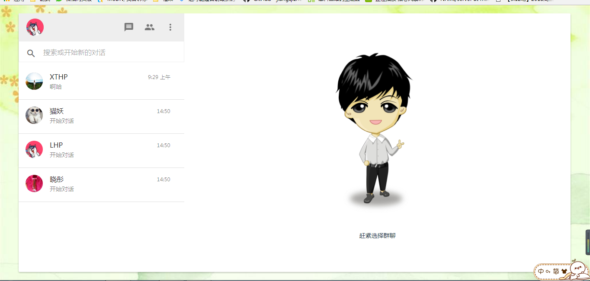
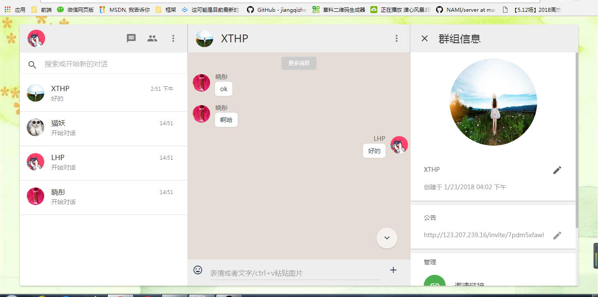
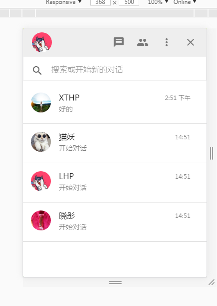
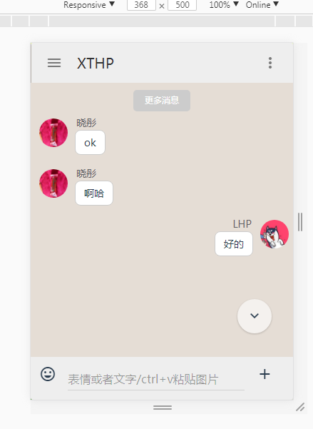

# XTHP 1.0
[](https://github.com/HaipingXiaotong)


>名字想法来自一个人，想记住[快速进入](http://123.207.239.16)

### 功能

 1.用户：包括登录、注册、个人信息管理、群组信息管理<br>
 2.消息：实现了群聊、私聊。包括表情图片文件发送，其中表情可以快捷输入，图片可以使用ctrl+v粘贴发送<br>
 3.群组：可以修改群组信息，还可以通过链接加入群组<br>
 4.favico提醒：消息提醒<br>

### 预览


 



### 安装
  前后台分离，因此需分别安装

``` bash 
git clone https://github.com/HaipingXiaotong/XTHP.git
启动客户端

 cd XTHP/app 定位目录到app
 npm install 安装插件
 npm run dev 启动客户端服务
 客户端本地端口localhost:8080

启动服务端

 cd XTHP/server 定位目录到server目录下
 npm install 安装插件
 npm start 启动服务端
 监听端口为localhost:3000

如以上端口占用 请重新设置端口 set port = ' '
```

### 后续 
1.作者本人一直想实现语音以及视频信息,将完善这一点<br>
2.诸多不足，谢谢指出，交流邮箱847186328@qq.com

